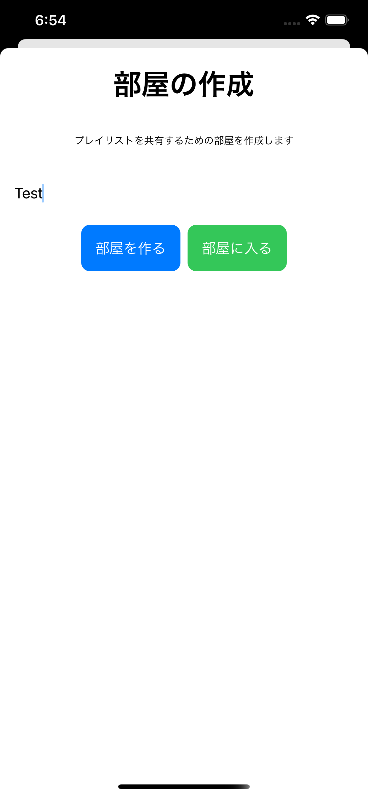
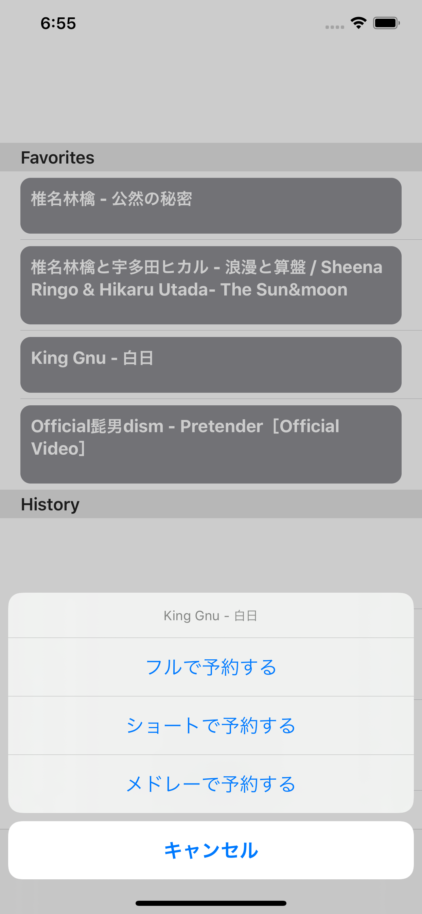
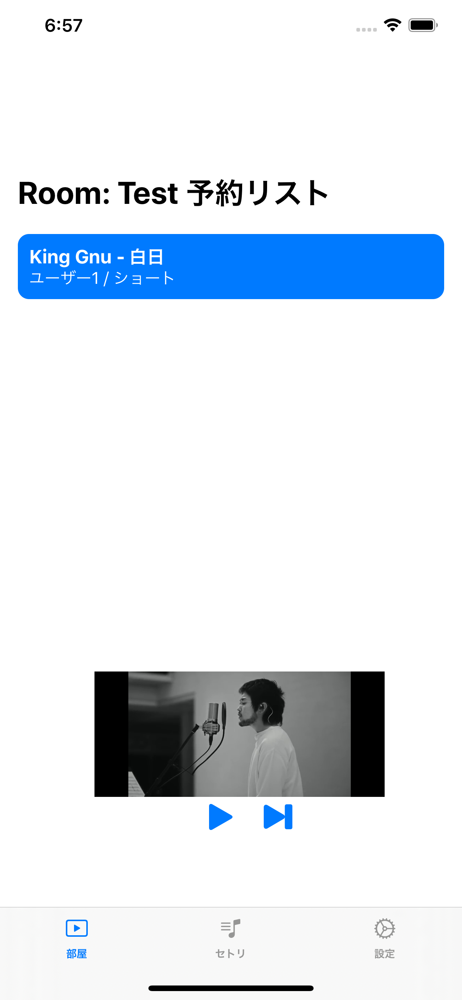
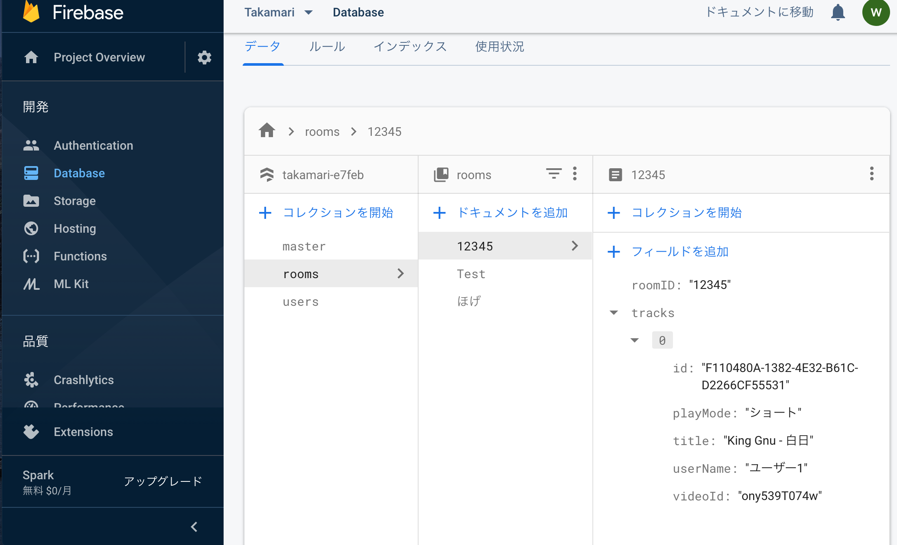

# Setori

## 概要
Firebase(BaaS)を使用してYoutube動画で曲をシェアして聴けるサービスを作成しました

## スクリーンショット & 紹介
まず、部屋を作成または既存の部屋に参加します。

予約する曲を選んで予約します。曲の一部分だけ流すことも可能です。

予約されている曲がカラオケのように順番に流れます。

データベースにも登録されています。

アプリはReduxアーキテクチャに則って作りました。

<https://medium.com/@andrewrymaruk/thunk-in-redux-360fe8ae8b5a> より引用

## 使用ライブラリ / フレームワーク
- SwiftUI (UI)
- [FireSnapshot](https://github.com/sgr-ksmt/FireSnapshot) (DB)
- CodableFirebase (Serialize)
- Firebase (Database, Auth)
- [ReSwift](https://github.com/ReSwift/ReSwift#demo) (Redux)
- [ReSwiftThunk](https://github.com/ReSwift/ReSwift-Thunk/blob/master/README.md) (Redux)
- YoutubeKit (Youtube Player)

## 感想
はじめてSwift言語に触れたので慣れない部分が多かったです。ですが、SwiftUIはWebフレームワークの様に宣言的にコード上でUIを書けるのであまり凝ったUIを作らないのであれば快適に使用することが出来ました。